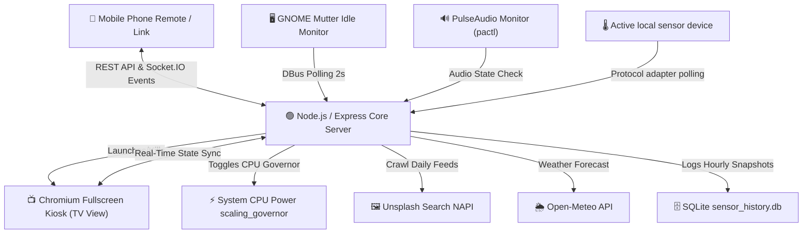

# 🌌 Lumina — AI Agent & Developer Reference Guide

Welcome, fellow AI agent or human developer! This document is designed to give you an immediate, comprehensive understanding of **Lumina**, a highly-optimized, Chromecast Ambient-mode screensaver and smart-display dashboard. It runs as a system-wide background daemon on Linux (GNOME/Mutter displays) with dynamic mobile remote control capabilities.

---

## 📌 Project Overview & Goals

**Lumina** transforms a local display (e.g., an HTPC or dedicated living room TV running Linux/Fedora) into an elegant, ambient smart display. It has three core design pillars:
1. **High Visual Excellence**: Beautiful high-definition wallpapers curated dynamically, accompanied by glassmorphic widgets, smooth transitions, and environmental effects (rain, snow, bokeh particles).
2. **System-Wide Idle Daemon Integration**: Integrates directly with GNOME's window manager (Mutter) and PulseAudio to launch and close a fullscreen kiosk screensaver automatically based on system idle state and sound activity.
3. **Extreme Performance & Resource Constraints**: Built specifically to run on resource-limited hardware (like older Intel Haswell/Celeron HTPCs). It employs strict CPU governor throttling, Chrome engine memory limitations, and a custom frontend double-buffer slideshow system to keep memory usage **under 80MB RAM** (down from Chromium's usual >1.5GB) and CPU usage at **near 0%** when not in screensaver mode.

---

## 🛠️ Architecture & Data Flow

Lumina utilizes a decoupled client-server architecture. The durable control surface is moving toward REST-first APIs, while Socket.IO remains the live-sync and low-latency event channel.

Current migration checkpoint:
- Phase 1 Step 1 complete: remote photo-control mutations are REST-first by default.
- Phase 1 Step 2 complete: remote durable state/settings mutations are REST-first by default.
- Phase 1 Step 3 complete: category selection, pool lifecycle, and feed-configuration mutations now use REST by default in operator UIs, with Socket.IO retained as the live sync/event transport.
- Phase 1 Step 4 complete: manual recrawl flows now start through REST-first async jobs, with Socket.IO reduced to live progress/status transport.
- Phase 1 Step 5 complete: manual vision-analysis runs now start through REST-first async jobs, with Socket.IO reduced to live progress/status transport.
- Next focus: the `server/sockets.js` transport-adapter pass, the durable-mutation audit, and the `server/app.js` Step 3 shell-composition refactor are complete. The live socket-only tail is intentionally limited to the on-demand signed-URL refresh helper plus truly ephemeral telemetry/update handlers, and the active implementation-companion checkpoint remains Step 4's command/effect readability pass. The latest slices collapsed the remaining standalone REST single-command registrations in `server/routes.js` onto one local method-aware spec table, then aligned the shared photo/pool patch transport families behind one common builder in `server/domain/commands.js`, so the route shell keeps its explicit `decode -> guard -> dispatch -> present` behavior while the command metadata keeps only one declarative route/socket shaper for those patch-style families. Future Step 4 work should continue only where shared data or tiny interpreters are genuinely clearer than the explicit route or reducer code they would replace.
- `FUNCTIONAL_REFACTOR_ROADMAP.md` is the supporting Phase 1 implementation track for this work, not a separate product roadmap; its step numbers are local to that engineering cleanup sequence.



---

## 📂 Project Structure

Here is a map of the codebase for quick navigation:

```text
lumina/
├── client/                     # React + Vite Frontend
│   ├── dist/                   # Production built assets (served by Express)
│   ├── src/
│   │   ├── components/
│   │   │   ├── Dashboard.jsx   # The "TV View" dashboard & environmental widget engine
│   │   │   └── RemoteControl.jsx # The "Remote View" mobile-optimized controller web UI
│   │   ├── App.jsx             # Main Router (Auto-detects TV vs Remote view, coordinates socket)
│   │   ├── index.css           # Premium styling, animations, themes, and glassmorphic designs
│   │   └── main.jsx            # React client entry point
│   ├── package.json            # Vite frontend configuration & dependencies
│   └── vite.config.js          # Vite build options
├── server/                     # Modular backend services & domain logic
│   ├── domain/                 # Functional core (commands, reducers, selectors, ecowitt, statePatch)
│   ├── runtime/                # Operational runtimes (environment refresh, browser kiosk control)
│   ├── services/               # System & API integrations (system, vision, googlePhotos)
│   ├── app.js                  # Express application setup
│   └── routes.js               # REST route spec registrations
├── curated_collections.json    # Local JSON database persisting photography feeds
├── sensor_history.db           # SQLite database persisting hourly environmental telemetry snapshots
├── launch.sh                   # Convenience shell wrapper to start server and background daemons
├── package.json                # Root package configuration & backend dependencies
└── AGENTS.md                   # You are here! (AI Agent & Developer Guide)
```

---

## ⚙️ Detailed Backend Architecture (`server.js`)

The Node.js backend handles state synchronization, API data proxying, local network discovery, dynamic Unsplash feed crawlers, and the core system daemon loops.

### 1. Core State Management
The server manages a centralized `screensaverState` object, which is broadcasted to all connected clients (TV and Remote controls) on change:
* `activePhoto`: `{ url, title, author }` (Current background image)
* `currentCategory`: `"Scenic Nature" | "Cosmic Space" | "Abstract Art" | "Liminal Spaces" | "AI Creations"`
* `theme`: `"Zen Retreat" | "Cosmic Night" | "Art Museum" | "Cyberpunk Rain"`
* `widgets`: `{ clock, weather, qrcode, particles, auraglow, animations }` (Booleans)
* `photosList`: Array of photo objects within the current category.
* `inactivityTimeout`: Time in milliseconds before screensaver launches (default `600000` / 10 minutes).
* `screensaverActive`: Boolean showing if screensaver mode is engaged.
* `slideshowInterval`: Time in milliseconds between photo rotations (default `120000` / 2 minutes).

### 2. GNOME / Mutter System Screensaver Daemon
Every 2 seconds, the server runs a DBus polling command. To handle different developer names and machine setups, the system **dynamically queries runtime environment properties** (via Node's `os.userInfo()`) to retrieve the correct `uid` (default `1000`) and user `homedir` (default `/home/username`), instead of using hardcoded paths:
```bash
DBUS_SESSION_BUS_ADDRESS="unix:path=/run/user/${uid}/bus" busctl --user call org.gnome.Mutter.IdleMonitor /org/gnome/Mutter/IdleMonitor/Core org.gnome.Mutter.IdleMonitor GetIdletime
```
If the system idle time exceeds `inactivityTimeout`, the screensaver is triggered, **unless** audio is actively playing:
* **Audio Playback Guard**: The server runs `pactl list sink-inputs`. If an active stream has `corked: no` or `pulse.corked = "false"`, sound is playing (e.g., a movie or music). The screensaver **will not** trigger to avoid interrupting the user's entertainment.
* **CPU Power Governor Orchestration**: 
  - When the screensaver starts, the CPU scaling governor is toggled to `performance` to guarantee liquid-smooth transitions (30/60fps Ken Burns panning and particle effects):
    `echo "performance" | sudo tee /sys/devices/system/cpu/cpu*/cpufreq/scaling_governor`
  - When the screensaver is dismissed (via mouse movement, keyboard event, or manual remote command), the scaling governor is restored to the energy-saving `schedutil` profile to run cool and silent:
    `echo "schedutil" | sudo tee /sys/devices/system/cpu/cpu*/cpufreq/scaling_governor`

### 3. Chromium Fullscreen Kiosk Launcher & Custom CLI Optimizations
When screensaver activation is triggered, the server spawns Chromium in fullscreen kiosk mode pointing to `http://localhost:5000/?mode=tv`. To ensure it never hangs the PC and has a tiny RAM footprint, it uses highly optimized Chromium CLI flags. It dynamically resolves wayland displays and authorities using the active `uid` and `homedir` to achieve robust startup:
* `--js-flags="--max-old-space-size=256"`: Strictly limits the V8 JS heap memory footprint to 256MB.
* `--disable-dev-shm-usage`: Avoids exhausting shared memory partitions.
* `--disk-cache-size=52428800 --media-cache-size=20971520`: Restricts disk and media cache to tiny allocations.
* `--disable-gpu-shader-disk-cache`: Eliminates heavy disk write activities.
* `--ignore-gpu-blocklist --enable-gpu-rasterization --enable-zero-copy --enable-native-gpu-memory-buffers --use-gl=egl`: Offloads all rendering and compositing straight onto the hardware GPU.
* The launcher runs native Wayland first using the discovered `uid` (`WAYLAND_DISPLAY=wayland-0 XDG_RUNTIME_DIR=/run/user/${uid}`), with a dynamic fallback method searching for Xwayland auth files (`.mutter-Xwaylandauth.*`) or using the user's `.Xauthority` file in their `homedir` for X11 fallback.

### 4. Multi-Source Daily Crawler & Keyword Auto-Tagging
* **Wider Selection of Photo Sources**:
  - Lumina maintains a keyless, multi-source wallpaper aggregator pulling from **Reddit subreddits** (`/r/EarthPorn`, `/r/spaceporn`, `/r/astrophotography`, `/r/AbstractArt`, `/r/Generative`, `/r/LiminalSpace`), **Lorem Picsum** random HD photography, the **Bing Image of the Day API** (providing high-quality curated daily wallpapers), and the **Unsplash search API** (NAPI).
  - **AI Creations Feed fallback**: If no paid `USEAPI_TOKEN` is set, the crawler falls back gracefully to a high-quality keyless dual pipeline fetching from **Lexica.art** (with queries like `midjourney landscape surreal dreamscape`) and **Wallhaven.cc** (using custom search query `cyberpunk landscape surreal` filtered for AI-generated landscapes).
  - Feeds are automatically limited to `2000` photos maximum per category and stored in `curated_collections.json` to enable offline resilience.
* **Robust Unsplash CDN Parsing (Avoiding 404s)**:
  - To prevent HTTP 404 broken links that occurred under legacy template patterns (e.g. `photo-${photoId}` templates), the Unsplash crawler pulls the direct raw CDN path (`item.urls.raw`) directly from the Unsplash API JSON payload.
* **Automated Keyword Tagging**:
  - During crawler execution and startup initialization, all images are dynamically scanned for keyword tags to support environmental matching.
  - Keywords are matched to classify photos across five atmospheric states:
    - `isNight`: Matches sunset, midnight, night, stars, dark, space, moon, etc.
    - `isRain`: Matches rain, storm, wet, stream, dewy, drizzle, puddle, etc.
    - `isSunny`: Matches sun, clear, bright, golden, morning, summer, daylight, warm, etc.
    - `isCloudy`: Matches mist, fog, cloud, misty, hazy, overcast, moody, eerie, shadow, silent, empty, etc.
    - `isSnowy`: Matches snow, winter, ice, frozen, cold, alpine, etc.
* **Fused Weather & News Sentiment Smart Alignment**:
  - Toggled via the **Atmospheric & News Sentiment Alignment** panel on the Remote Control.
  - The system merges **live meteorological conditions** (retrieved from Open-Meteo) with **today's global news sentiment** (scraped from Google News RSS):
    - **News Sentiment Analyzer**: Scrapes today's latest top headlines in real-time, matching words against heuristic positive and negative lexicons to calculate a net emotional score.
    - **Correlation Mapping**: 
      - Highly negative sentiment (score $\le -0.1$) maps to **Stormy/Rainy** wallpapers (reflecting a turbulent, dark day).
      - Highly positive sentiment (score $\ge 0.1$) maps to **Sunny/Golden** wallpapers (reflecting a bright, optimistic day).
      - Neutral sentiment maps to **Cloudy/Moody** wallpapers.
    - **Atmospheric Fusion Rule**: 
      - If physical weather reports active snowfall, **Snowy** photos are prioritized.
      - If physical weather reports active rainfall, **Rainy** photos are prioritized.
      - Otherwise, the room's mood is set by **today's global news sentiment** (prioritizing Sunny, Cloudy, or Rainy/Moody wallpapers accordingly).
    - Photos matching these atmospheric filters are served with an **80% preference weight** to preserve surprise while aligning the living space with the emotional and physical state of the world outside. Under night hours, this integrates with the user's evening/night photo ratio slider.

### 5. Local Environment & Sensor Telemetry Platform
* **Gateway Adapter (`server/services/ecowitt.js`)**:
  - Polls gateways and consoles exposing Ecowitt's generic local HTTP API at configurable intervals (default 60s) for indoor temperature, humidity, and barometric pressure. GW1200 is the first verified device.
  - Normalizes metric units (`temperatureC`, `humidityPercent`, `pressureAbsoluteHpa`, `pressureRelativeHpa`) while handling missing fields or stale network states defensively without interrupting Open-Meteo outdoor weather calculations.
* **Saved Device Profiles (`server/domain/environmentSettings.js`)**:
  - Retains named sources with a registered adapter, address, polling interval, and timeout while running exactly one active source. Existing flat `config.ecowitt` settings migrate automatically and remain available as a compatibility projection.
* **Persistent SQLite Sensor Storage (`sensor_history.db`)**:
  - Stores hourly environmental snapshots in SQLite, persisting full raw `gateway_metrics` payloads to retain optional multichannel, air quality (PM2.5), rain, wind, and leaf sensor blocks without requiring schema migrations.
* **Grafana & CSV Export API**:
  - `GET /api/environment/history/export?format=csv` projects sensor history directly into CSV format for Grafana Infinity plugin integration, spreadsheet analysis, and archival downloads.
* **Display Units & Remote Controls**:
  - Presentation display units are configurable from Remote Control → System → Environment. The adaptive admin uses a list–detail manager on expanded windows and a stacked phone layout. Polling is represented by the mutually exclusive active source; the separate semantic switch only controls whether indoor readings appear on the TV.

### 6. API Endpoints
* `GET /api/environment`: Resolves current normalized indoor environment readings, observation timestamp, and gateway availability status.
* `GET /api/environment/history`: Returns historical hourly environment snapshots (supports `from`, `to`, and `limit` query parameters).
* `GET /api/environment/history/export`: Exports environment history as CSV (`?format=csv`) or JSON for Grafana Infinity plugin and direct downloads.
* `GET /api/environment/settings` / `POST /api/environment/settings`: Reads or updates saved device profiles, the active source, connection timing, and display unit preferences. Legacy flat Ecowitt payloads remain accepted.
* `GET /api/environment/adapters`: Lists registered sensor adapters and capabilities. Ecowitt is the first adapter; new protocols should implement the shared sensor-platform contract instead of changing storage or widget consumers.

Ecowitt compatibility uses the vendor’s published local HTTP API endpoint `GET /get_livedata_info`; refer users to the [official Ecowitt HTTP API protocol](https://oss.ecowitt.net/uploads/20260109/HTTP%20API%20interface%20Protocol%20%28Generic%29-%28V1.0.5-2025-10-08%29.pdf) when evaluating gateway or sensor compatibility.
* `GET /api/weather`: Resolves location weather from the Open-Meteo API.
  > [!NOTE]
  > The server uses the location configured in the local gitignored `config.json`, with optional automatic IP geolocation when enabled.
* `GET /api/photos?category=...`: Returns current photos list for the category, updating active photo selection if needed.
* `PATCH /api/photos`: REST mutation endpoint to update photo ratings, loved status, crops, and side-by-side pairing preferences.
* `POST /api/photos/next` / `POST /api/photos/prev`: Advance or rewind photo selection through the balanced visible feed order.
* `POST /api/state/screensaver`: Kiosk screensaver activation toggle (`active: true|false`).
* `GET /api/config`: Exposes local IP addresses and ports to allow QR coupling of mobile screens.

### 7. Safe Read-Merge-Write Persistence & Ratings Engine
Lumina implements a highly robust database persistence and rating system located under `server/config/collections.js` to manage wallpapers without losing user preferences:
* **Safe Read-Merge-Write Persistence (`saveCuratedCollections`)**:
  - To prevent background daily crawls or crawler actions from wiping out existing metadata (like manually selected location settings, auto-location toggles, or keyword settings), the system performs a read-merge-write sequence before persisting to `curated_collections.json`.
  - It parses the current JSON file, merges the new feeds, search keywords, and location configurations together, and then writes the result atomically back to disk.
* **Instant Skip & Prune on Banned Photos (Rating 1)**:
  - If a photo's rating is set to `"1"` (Banned or Broken):
    - The photo is instantly pruned from `state.photosList` in memory.
    - If the banned photo is currently active on the TV view (`state.activePhoto`), both the POST handler and the socket ratings handler trigger an **immediate, real-time transition** to the next available smart photo in the feed, pushing a socket `'photo-update'` event to keep the TV screen responsive.
* **Test-Mode Database Write Protection**:
  - To prevent unit testing workflows or automated tests from corrupting the production database, all fs writes are guarded by checking `process.env.NODE_ENV !== 'test'`.

---

## 🎨 Detailed Frontend Architecture (`client/`)

The client is built using React (Vite) and styled with raw vanilla CSS to enable premium responsive interfaces.

### 1. Dual-Device Presentation Modes (`App.jsx`)
* The frontend automatically detects its running environment.
* If a touch-based viewport or mobile user-agent is found, or if `?mode=remote` is in the URL, it loads **Remote Control Mode** (`RemoteControl.jsx`).
* Otherwise, it loads the **TV Dashboard View** (`Dashboard.jsx`). A floating switcher button is available to toggle views manually.

### 2. TV Dashboard UI & Environmental Animations (`Dashboard.jsx`)
* **Double-Buffer Slideshow (DOM Memory Guard)**: 
  > [!IMPORTANT]
  > Keeping multiple high-resolution (2K/4K) images in the DOM causes Chromium's memory footprint to swell past 1.5GB, leading to out-of-memory locks. 
  >
  > The frontend fixes this by keeping **at most two slide elements** in the DOM (one fading out, one active). In the background, it preloads the incoming image via a native `Image()` element, and only mounts it when loading is complete, dropping memory usage to **under 80MB**.
* **Bokeh Canvas Particle Engine**: A lightweight HTML5 canvas rendering floating ambient dust motes. Resolution is downscaled internally by 0.25x and scaled back up via CSS GPU compositor. This adds a beautiful, soft natural blur to the bokeh circles and **halves CPU usage**.
* **Weather Overlay animations**: Custom CSS animations trigger based on active weather codes (Drifting clouds, falling rain drops, and organic drifting snow flakes).
* **Low Power Stealth Clock**: When the screensaver is *inactive* (user is using the PC), a pitch-black screen cover is active, and a tiny, faint stealth clock is visible in the bottom-right corner as a screen-saver placeholder.

### 3. Mobile Remote Control (`RemoteControl.jsx`)
* **Direct Gesture Control**: Features an interactive swipe pad. Swiping left or right fires Socket.io pagination events. The pad background displays a darkened real-time preview of the active TV photo.
* **Mood Aesthetics Panel**: Toggles the overall theme profile of the screensaver.
* **System Switchboard**: Enables remote control of individual TV widgets (clock, particles, weather, aura backlights, Ken Burns pan-and-zoom) and transitions.
* **Google Photos Connector Layout**: A configuration interface ready to receive Google OAuth client credentials for direct private album casting.

---

## 🛰️ Real-Time Socket.IO API Contracts

Socket.IO remains the real-time synchronization channel, but durable control and settings work should continue migrating toward REST mutations backed by the shared domain command path.

| Event Name | Direction | Payload Schema | Action / Purpose |
| :--- | :--- | :--- | :--- |
| **`state-sync`** | Server ➔ Client | Full `screensaverState` object | Broadcasts full unified state to keep remote and TV dashboard completely in sync. |
| **`photo-update`** | Server ➔ Client | `{ url, title, author }` | Directs clients to transition to a specific image. |
| **`ip-info`** | Server ➔ Client | `{ localIps: String[], port: Number }` | Sent on connection to help build the QR coupling links. |
| **`toggle-widget`**| Client ➔ Server | `{ widgetName: String, visible: Boolean }` | Show/hide widgets (e.g. `clock`, `weather`, `particles`). |
| **`change-category`**| Client ➔ Server | `String` (Category Name) | Switches active wallpaper feed and picks a random starting photo. |
| **`change-interval`**| Client ➔ Server | `Number` (Interval in milliseconds) | Sets slide rotation cycle duration (15s, 1m, 2m, 5m). |
| **`set-active-photo`**| Client ➔ Server| `{ url, title, author }` | Forces a specific wallpaper selection. |
| **`next-photo`** | Client ➔ Server | *None* | Iterates to the next photo in the active category array. |
| **`prev-photo`** | Client ➔ Server | *None* | Iterates to the previous photo in the active category array. |
| **`change-theme`** | Client ➔ Server | `String` (Theme Name) | Switches color scheme and glow filters across all interfaces. |
| **`set-screensaver-active`**| Client ➔ Server| `Boolean` (Active state) | Toggles manual override. `true` forces Kiosk launch, `false` forces Kiosk dismissal. |
| **`toggle-align-time`**| Client ➔ Server| `Boolean` (Enabled) | Toggles evening/night image alignment during night hours. |
| **`toggle-align-weather`**| Client ➔ Server| `Boolean` (Enabled) | Toggles rainy image alignment when active precipitation is detected. |
| **`change-night-percentage`**| Client ➔ Server| `Number` (0-100) | Adjusts the percentage slider of evening/night photos displayed. |

---

## 🌈 CSS Mood Theme Systems

Styles are managed under `client/src/index.css` via custom theme profiles defined by classes:

1. **`theme-zen-retreat`** (`🌿`)
   * Accent: Soft Sage Green (`#86efac`)
   * Ambient Glow: Pale organic green gradients.
   * Atmosphere: Calming, naturalistic lighting.
2. **`theme-cosmic-night`** (`🪐`)
   * Accent: Deep Space Violet (`#a855f7`)
   * Ambient Glow: Cosmic purple and stellar dust nebula shaders.
   * Atmosphere: Mystic, late-night deep-space aesthetic.
3. **`theme-art-museum`** (`🏛️`)
   * Accent: Warm Gallery Gold (`#f59e0b`)
   * Ambient Glow: Soft gold-sepia warm spotlight vignette filters.
   * Atmosphere: Sophisticated, quiet gallery ambience.
4. **`theme-cyberpunk-rain`** (`🌧️`)
   * Accent: Neo-Tokyo Magenta (`#ec4899`)
   * Ambient Glow: High-contrast neon blue and pink overlays.
   * Atmosphere: Vibrant, wet futuristic urban environment.

---

## 🚀 Execution & Command Operations

To install and run Lumina, execute the following commands in the workspace root:

### 1. Install Dependencies
```bash
# Installs server and front-end dependencies recursively
npm run install-all
```

### 2. Start Developer Mode
```bash
# Starts both the Express core and the Vite web client concurrently
npm run dev
```

### 3. Production Daemon Control
The production-ready `launch.sh` script automates headless server boots in the background:
```bash
# Set execute permissions
chmod +x launch.sh

# Starts express server and redirects logs to server.log
./launch.sh
```

### 4. Running Regression Tests
Lumina includes a custom, zero-dependency, color-coded diagnostic testing framework to prevent any regressions in spelling normalizations, environmental tagging, and socket controls. Run this suite at the end of every work turn:
```bash
# Executes unit and integration smoke tests
npm test
```

---

## 🤖 AI Agent & Developer Guidelines

If you are an AI agent or developer modifying this codebase, you **MUST** strictly adhere to the following operational instructions:
1. **The Scout Rule (Core Directive)**: Proactively leave the codebase better than it was before. For every change, look for at least one piece of code to clean, document, or make more functional/declarative. If you identify a defect or a design flaw, and the fix is simple and quick, do it immediately. Otherwise, log it in the Tech Debt / Backlog documentation section.
2. **Abide by the Nine Maxims**: Read and strictly follow the [Lumina Coding Conventions & Philosophy](./CONVENTIONS.md) which institutionalizes our attitudes regarding clean code, functional style, SOLID design, small commits, automated testing, anti-overengineering, and privacy protection.
3. **Mandatory Git Commits**: Proactively make atomic, structured Git commits at **every substantive change** (e.g., adding a feature, fixing a bug, updating configurations). Do not wait until the end of the work session to commit all files. Keep commits under 4 files and 300 LOC where possible.
4. **Hardened Error Boundaries & Self-Healing**: Never let errors cascade or crash the main server daemon. Wrap all system-level commands (DBus Mutter polling, `pactl` audio checks, `scaling_governor` operations) in robust try/catch blocks with fail-safe recovery fallbacks.
5. **Loop & Skip Protections**: Always rate-limit and boundary-constrain recursive transitions or skip skips. Do not allow rapid high-frequency socket events to flood the client interfaces under error or offline conditions.
6. **Mandatory Pre-Flight Diagnostics**: Always run the regression test suite (`npm test`) before ending your turn to ensure that all core tagging keywords, weather-sentiment selectors, and API endpoints are 100% healthy.
7. **Always Bind Image Event Handlers Before Setting `src`**: Assign event handlers (`img.onload` and `img.onerror`) to `Image` elements *prior* to setting `img.src = url`. For cached images, browsers might load and trigger events synchronously; setting `src` first will cause events to fire into the void, resulting in stuck preloader indicators ("Preloading preview...").
8. **Synchronize In-Place Slideshow State Properties**: When checking if the active slide needs updating in `useEffect` (e.g., in `Dashboard.jsx`), do not rely on URL identity checks alone. If only properties like `cropPercent` or `cropPositionY` have changed, apply these updates in-place inside `activeSlides` so they re-render correctly.
9. **Target Active Slides in Browser Automation Tests**: When writing end-to-end integration tests (e.g., in `test_split_sync.js`), always prepend `.slide.active` to selectors targeting images or content. This ensures selectors target the active slide and do not match old transitioning-out slides still lingering in the DOM during cross-fades.
10. **Develop, Run, and Test ONLY on Playwright (Never Copy to Filament)**: Lumina is developed, tested, and run exclusively on the `playwright` host (`alex@playwright`), which is the TV computer. The local host environment (`filament`) is only used for editing (via `sshfs` mount) and lacks the required GUI libraries, Chromium dependencies, and system configuration. **NEVER** attempt to copy the project files to `filament` or run/test/deploy the app locally on `filament`. All execution must target `playwright` directly.
11. **No Personal Information in Git Commits**: Because git commits are pushed to a public repository on GitHub, you **MUST** ensure that no personal information (such as personal usernames, credentials, access tokens, OAuth secrets, local IP schemes, or personal paths) is saved in the project's git commits. Always inspect diffs (`git diff`) before committing. It is, however, perfectly fine to save operational instructions in OpenClaw files (like this `AGENTS.md` or `.agents/AGENTS.md`).
12. **Double-Journaling Learnings Mandate**: You **MUST** record your insights, architectural decisions, and wrong assumptions when making substantive changes. Keep local machine/network configurations in `.agents/MEMORY.md` (a local uncommitted file created on demand and excluded from Git), and document generic codebase updates, gotchas, and lessons learned in the public, git-tracked `DEVELOPER_LOG.md` at the root. Keep both files up-to-date at the end of every work session.


---

## 🔮 Active Backlog & Future Developer Roadmap

If you are an AI agent or a developer tasked with extending Lumina, here are excellent planned features you could implement:
* **Dynamic Geolocation API**: Improve the optional IP-lookup location flow (e.g. `ip-api.com` or `ipinfo.io`) while keeping explicit local `config.json` coordinates authoritative when selected.
* **OAuth Google Photos integration**: Implement the actual server-side token storage and Google OAuth redirect handler in `server.js` to back the existing credentials input forms in `RemoteControl.jsx`.
* **Smart Home Integrations**: Add an Express webhook (e.g. `POST /api/alert`) that temporarily overlays push notification bubbles on the TV view (e.g. "Front door bell rang") using standard Socket.io events.
* **Audio Spectrum Visualizer Widget**: Connect to a local browser audio node when screensaver animations are active to draw a matching organic visualizer bar at the bottom screen borders.
