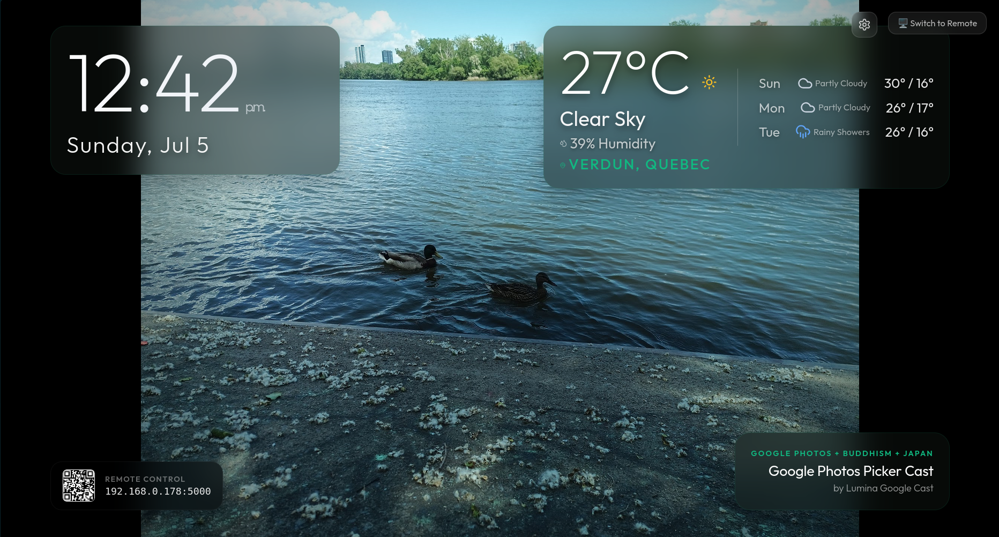
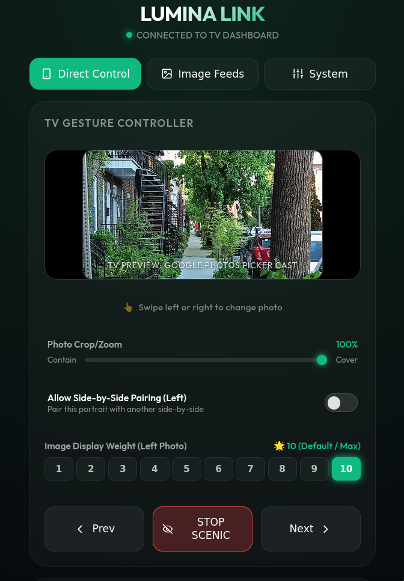

# 🌌 Lumina

Lumina is an elegant, ambient smart display dashboard and Chromecast-style screensaver built for Linux (GNOME/Mutter desktops). Designed to run continuously on dedicated HTPC or home theater setups (such as living room TV PCs), Lumina fuses real-time atmospheric conditions, Google News RSS sentiment analysis, generative AI art, and classical art feeds with native system power control and smart media detection.

It features a dynamically coupled mobile remote control web app that allows full control, swipe-to-navigate gesture pads, and widgets management.

---

## 📸 Screenshots

| 📺 TV Dashboard Display | 📱 Mobile Remote Control |
| :---: | :---: |
|  |  |

---

## ✨ Features

* **🎭 Dynamic Multi-Source Visual Feeds**: Pulls wallpapers dynamically from a rich array of keyless and API aggregators:
  * **Unsplash Search API** (NAPI direct CDN resolution to prevent broken links).
  * **Reddit Subreddits** (including `/r/EarthPorn`, `/r/spaceporn`, `/r/astrophotography`, `/r/AbstractArt`, `/r/Generative`, `/r/LiminalSpace`).
  * **Bing Image of the Day API** (high-definition curated daily photography).
  * **NASA Astronomy Picture of the Day (APOD)**.
  * **Lorem Picsum** random HD photography.
  * **AI Creations fallback**: Automatically uses Lexica.art (surreal dreamscapes) and Wallhaven.cc (cyberpunk) keyless pipelines if no paid `USEAPI_TOKEN` is configured.
  * **Public Art Museums**: Imports classical artworks from the Metropolitan Museum of Art and Art Institute of Chicago (AIC).
* **🌦️ Fused Meteorological & RSS News Sentiment Alignment**:
  * Scrapes Google News RSS top headlines in real-time, matching words against heuristic positive and negative lexicons to calculate a net emotional score.
  * Positive headlines map to sunny/golden wallpapers, negative to stormy/rainy, and neutral to cloudy/moody.
  * Integrates active weather conditions (via Open-Meteo) so that active precipitation (snow, rain) overrides news sentiment.
  * Wallpaper candidates matching these states are served with an **80% preference weight**.
* **📱 Touch-Optimized Mobile Remote Control**:
  * Interactive swipe pad featuring a darkened real-time preview of the active TV background image.
  * Widgets Switchboard: Toggle TV overlays (clock, particles, weather, aura backlights, Ken Burns pan-and-zoom) on the fly.
  * Mood Theme Selector: Change color schemes instantly (Zen Retreat, Cosmic Night, Art Museum, Cyberpunk Rain).
  * Google Photos casting control (direct configuration for OAuth client credentials).
* **🎵 Smart Media Playback Guard**:
  * Actively monitors PulseAudio/PipeWire sink streams via `pactl list sink-inputs`.
  * If a movie is playing or music is active (e.g. Plex, YouTube, Spotify), screensaver activation is automatically bypassed to avoid interrupting entertainment.
* **⚡ CPU Governor Orchestration**:
  * Scales the CPU governor to `performance` when screensaver transitions or particle systems are active for fluid 60fps animations.
  * Restores governor to energy-saving `schedutil` (or powersave) when the screensaver is dismissed (achieving near 0% background CPU impact).
* **🧠 Under 80MB RAM Footprint**:
  * Implements strict V8 engine heap limits (`--max-old-space-size=256`).
  * Uses a client-side image double-buffer slideshow system that preloads incoming wallpapers in the background and mounts at most two slide elements in the DOM, eliminating typical memory locks.
  * Downscales the canvas particles engine by 0.25x (scaled back up via CSS GPU compositor) to halve CPU rendering usage.
* **🔒 Safe Read-Merge-Write Persistence & Ratings Engine**:
  * Perform read-merge-write operations to prevent crawler runs from overwriting manually curated metadata, rating configurations, and search keywords.
  * Banning a photo (rating "1") instantly prunes it from the feed and triggers an immediate transition on all active displays.

---

## 🛠️ Architecture

Lumina uses a decoupled client-server architecture:
* **Server (Node.js/Express)**: Spawns the GNOME Mutter idle state DBus monitor (running every 2s, dynamically querying `uid` and `homedir`), manages local network discovery, processes news sentiment and weather geolocated coordinates, orchestrates CPU governors, and serves API endpoints.
* **Client (React/Vite/Vanilla CSS)**: Auto-detects device type (loading Mobile Remote Control or TV Dashboard Kiosk) and renders layouts with glassmorphic styles, bokeh particle canvas systems, and customized weather overlays.

---

## 🚀 Quick Start

### 1. Requirements
Ensure you have Node.js (v18+) and standard Linux utilities (`chromium`, `busctl`, `pactl`) installed on your target machine.

### 2. Installation
Clone the repository and install dependencies:
```bash
git clone https://github.com/esaul314/lumina.git
cd lumina
npm run install-all
```

### 3. Setup Configuration
Lumina uses two local configuration files:
1. `config.json` for non-secret runtime overrides (port, geolocated coordinates, etc.).
2. `.env` for secrets and API keys.

Initialize default configurations:
```bash
cp config.json.example config.json
cp .env.example .env
```

*(Both `config.json` and `.env` are gitignored and will never be committed to your repository.)*

### 4. Running Lumina
For development mode:
```bash
npm run dev
```

For production daemon:
```bash
chmod +x launch.sh
./launch.sh
```
* **Screensaver/TV Display**: `http://localhost:5000/?mode=tv`
* **Mobile Remote Control**: `http://localhost:5000/`

### 5. Installing as a Persistent `systemd` User Service
For the dedicated host, run the service under the logged-in user's systemd manager to grant access to the active GNOME session, Mutter DBus, PulseAudio, and kiosk display:
```bash
./scripts/install-systemd-user-service.sh
loginctl enable-linger "$(id -un)"
```

Common service commands:
```bash
systemctl --user status lumina
systemctl --user restart lumina
journalctl --user -u lumina -n 100 --no-pager
```

---

## 🧪 Testing

Lumina includes a custom, zero-dependency unit and integration regression test suite:
```bash
npm test
```

---

## 🛡️ License

Distributed under the MIT License. See `LICENSE` for details (if applicable). Made for home theater enthusiasts and autonomous developers.
