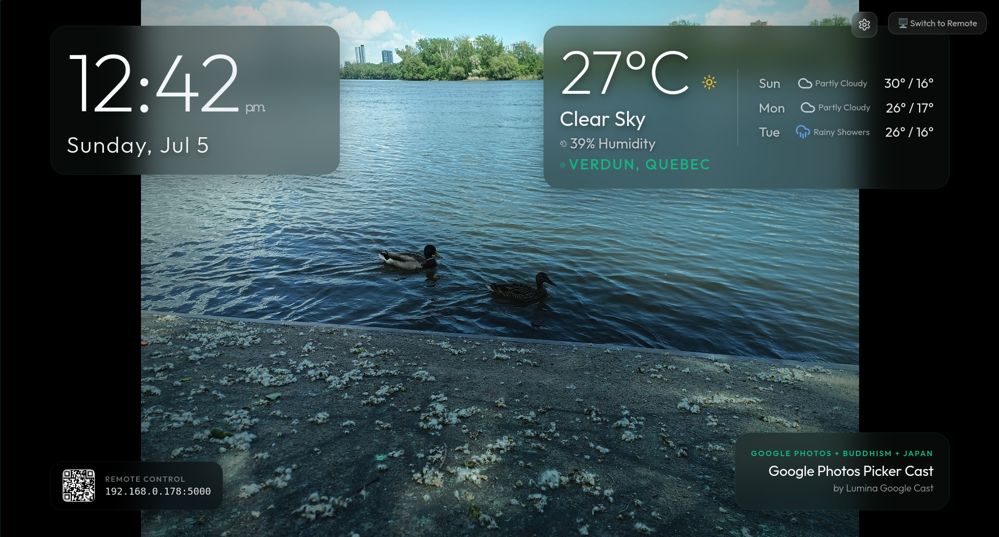
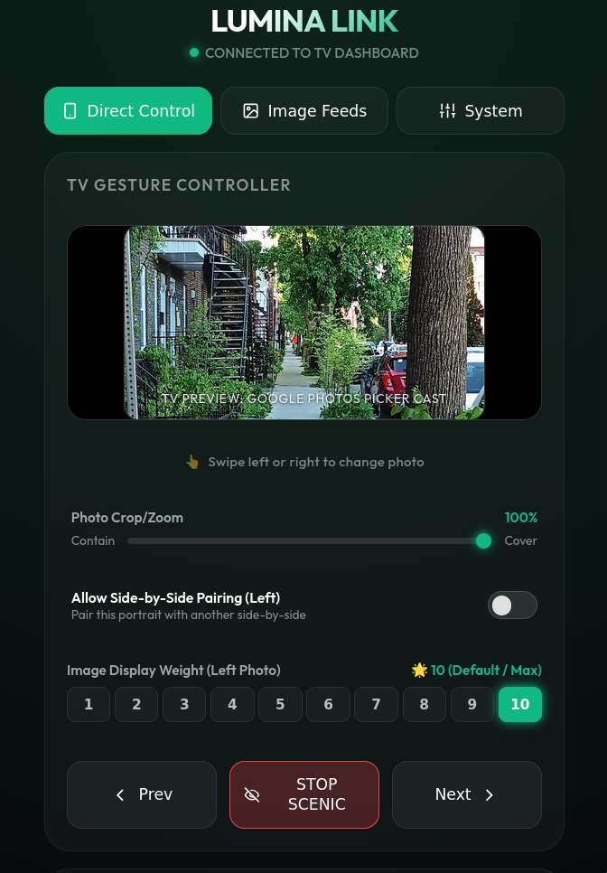
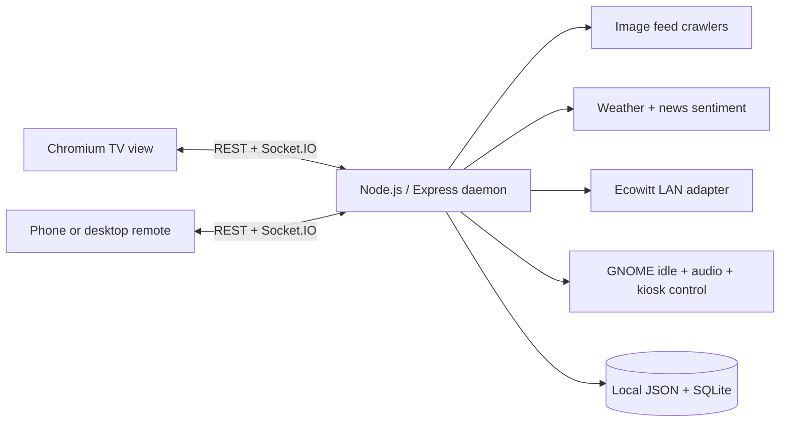

# Lumina

Lumina turns a Linux desktop into a calm, network-aware ambient display: curated images, quiet widgets, weather, local sensor readings, and a phone-friendly remote control for the room.

It is designed for a dedicated HTPC or living-room display running GNOME/Mutter. The project is deliberately local-first: one Node.js daemon owns durable state and system integration, while a React client provides the TV and remote experiences.

<table>
  <tr>
    <td align="center" valign="top">
      <strong>TV dashboard</strong><br />
      
    </td>
    <td align="center" valign="top">
      <strong>Mobile remote</strong><br />
      
    </td>
  </tr>
</table>

## What it does

- **Ambient TV view** — cross-faded wallpapers, clock and weather widgets, optional bokeh, atmospheric overlays, themes, crop controls, and portrait split-screen presentation.
- **Remote control** — a responsive mobile UI for categories, pools, ratings, loved photos, feed sources, system settings, screensaver control, and Google Photos.
- **Many image sources** — configurable combinations of Reddit, Tumblr, Unsplash, Wallhaven, Lorem Picsum, Bing, NASA APOD, the Metropolitan Museum of Art, the Art Institute of Chicago, and AI-oriented sources. Provider availability and credentials vary by feed.
- **Mood-aware selection** — Open-Meteo weather and Google News RSS sentiment can influence the visual atmosphere. Manual location settings are supported, with an optional IP-geolocation fallback.
- **Local environment telemetry** — an Ecowitt-compatible LAN HTTP adapter reads indoor temperature, humidity, and pressure; hourly readings can be retained in SQLite and exported for analysis.
- **Curation tools** — rate or ban images, keep loved images in the collection, edit crops, exclude keywords, configure pools and schedules, and optionally run background vision analysis.
- **Desktop integration** — a GNOME/Mutter idle monitor launches the Chromium kiosk after inactivity, while PulseAudio/PipeWire activity prevents interruption during playback.
- **Resilient slideshow behavior** — the TV preloads the next frame through one authoritative path, retries transient media failures at 1, 2, 4, and 8 seconds, and holds the current image when its host is unreachable.

Lumina keeps the browser’s slideshow bounded to at most two slide elements. That is a memory-conscious design constraint, not a promise of a fixed whole-process RAM footprint; Chromium, GPU drivers, image dimensions, and enabled effects still matter.

## Architecture at a glance


```mermaid
flowchart LR
    TV[Chromium TV view] <-->|REST + Socket.IO| Core[Node.js / Express daemon]
    Remote[Phone or desktop remote] <-->|REST + Socket.IO| Core
    Core --> Feeds[Image feed crawlers]
    Core --> Weather[Weather + news sentiment]
    Core --> Sensors[Ecowitt LAN adapter]
    Core --> System[GNOME idle + audio + kiosk control]
    Core --> Data[(Local JSON + SQLite)]
```

The control surface is REST-first for durable mutations. Socket.IO remains the live-sync and progress channel, with compatibility handlers retained during the migration. The client keeps snapshot normalization at one boundary so TV and remote views consume the same state shape.

## Runtime requirements

Lumina targets a Linux desktop session with:

- Node.js 18 or newer
- Chromium or a Chromium-compatible kiosk binary
- GNOME/Mutter session utilities: `busctl` and a working user D-Bus session
- PulseAudio or PipeWire’s `pactl` command for the media-playback guard
- A display session available to the logged-in user when kiosk mode is enabled

The server listens on port `5000` by default and serves the production client from `client/dist`. The idle daemon uses a 10-minute inactivity threshold by default. The development client uses Vite on port `5173` and routes API/socket traffic to the server.

## Quick start

```bash
git clone https://github.com/esaul314/lumina.git
cd lumina
npm run install-all
cp config.json.example config.json
cp .env.example .env
```

Edit `config.json` for local, non-secret settings such as the port, location, Ecowitt gateway, units, and sensor-history retention. Put credentials and API tokens in `.env`; both files are ignored by Git.

Start the development server and Vite client:

```bash
npm run dev
```

Open one of these views:

| View | URL |
| --- | --- |
| TV dashboard | <http://localhost:5173/?mode=tv> |
| Remote control | <http://localhost:5173/?mode=remote> |

Without `mode`, Lumina chooses a view from the viewport and user agent. A desktop-sized browser defaults to the TV view; a small or mobile browser defaults to the remote.

## Production deployment

Build the client before starting the daemon:

```bash
npm --prefix client run build
./launch.sh
```

The launcher starts the Node server and refuses to create a duplicate instance when port `5000` is already owned. The production URLs are:

- TV: <http://localhost:5000/?mode=tv>
- Remote: <http://localhost:5000/?mode=remote>

For a persistent desktop installation, use the user service installer. It derives the current user, home directory, Node path, D-Bus address, and runtime directory instead of requiring a hand-edited unit:

```bash
./scripts/install-systemd-user-service.sh
loginctl enable-linger "$(id -un)"   # optional: start the user service without an active login
```

Useful diagnostics:

```bash
systemctl --user status lumina
systemctl --user restart lumina
journalctl --user -u lumina -n 100 --no-pager
```

## Configuration and integrations

### Image feeds

The remote’s **Image Feeds** workspace manages categories, keywords, source toggles, pool retention, and scheduled activation. The built-in categories are Scenic Nature, Cosmic Space, Abstract Art, Liminal Spaces, and AI Creations, but pools are extensible.

Some integrations are keyless; others are optional:

| Environment variable | Used for |
| --- | --- |
| `NASA_API_KEY` | NASA Astronomy Picture of the Day; the example uses `DEMO_KEY` |
| `USEAPI_TOKEN` | Optional UseAPI/Midjourney source for AI Creations |
| `TUMBLR_API_KEY` | Optional Tumblr tagged-search source |
| `GOOGLE_CLIENT_ID`, `GOOGLE_CLIENT_SECRET` | Google Photos OAuth setup |

Feeds are network-dependent and can be rate-limited or unavailable. A failed provider should reduce that provider’s contribution, not invalidate the local collection.
Review each provider’s terms, rate limits, attribution requirements, and image licensing before enabling a feed for anything beyond personal use.

### Ecowitt-compatible sensors

In **Remote → System → Environment**, add an Ecowitt-compatible LAN gateway and select the active source. Lumina polls one active profile at a time through `GET /get_livedata_info`, normalizes canonical metric values, and keeps the configured display units separate from storage.

The adapter boundary currently covers temperature, humidity, pressure, and the raw gateway payload. Compatibility includes GW1100, GW1200, GW2000, GW3000, and compatible consoles that expose the generic LAN API. Check the [official Ecowitt HTTP API protocol](https://oss.ecowitt.net/uploads/20260109/HTTP%20API%20interface%20Protocol%20%28Generic%29-%28V1.0.5-2025-10-08%29.pdf) for device-specific payload support.

### Weather and location

Lumina uses Open-Meteo for outdoor conditions and daily forecasts. The configured location is the normal source; the weather service can fall back to IP geolocation when automatic location is enabled. Weather alignment and time-of-day alignment are independently configurable from the remote.

### Google Photos

The remote can register Google OAuth credentials, complete the local OAuth flow, and use the Google Photos picker. Selected media is cached as an external collection and proxied by the server so the TV can display it without exposing provider tokens to the browser.

## REST API surface

The API is intentionally small and inspectable. Examples:

```bash
curl http://localhost:5000/api/state
curl http://localhost:5000/api/photos?category=Scenic%20Nature
curl http://localhost:5000/api/environment
curl http://localhost:5000/api/environment/history/export?format=csv
```

The main routes are:

| Area | Routes |
| --- | --- |
| State and display | `GET /api/state`, `PATCH /api/state`, `POST /api/state/categories`, `POST /api/state/screensaver` |
| Photos | `GET /api/photos`, `PATCH /api/photos`, `POST /api/photos/rate`, `POST /api/photos/next`, `POST /api/photos/prev`, `POST /api/photos/preview` |
| Pools and feeds | `GET /api/pools`, `POST /api/pools`, `PATCH /api/pools/:name`, `DELETE /api/pools/:name`, `GET /api/pools/:name/photos`, `PATCH /api/pools/:name/feed-sources/:source`, `POST /api/pools/:name/crawl`, `POST /api/config/keywords` |
| Background work | `POST /api/jobs/recrawl`, `POST /api/jobs/vision-analysis` |
| Environment | `GET/POST /api/environment/settings`, `GET /api/environment`, `GET /api/environment/adapters`, `GET /api/environment/history`, `GET /api/environment/history/stats`, `GET /api/environment/history/export` |
| Integrations | `GET /api/weather`, `GET /api/config`, admin-secret routes, Google Photos auth and media proxy routes |

Socket.IO broadcasts `state-sync`, photo updates, job status, connection information, and live progress. Durable changes should use REST; sockets are still useful for low-latency UI synchronization and legacy clients.

## Development workflow

Run the baseline checks from the repository root:

```bash
npm test
npm run lint
git diff --check
npm run test:integration
```

For a production-client check:

```bash
npm --prefix client run build
```

The repository’s tests cover domain reducers and selectors, request/response boundaries, feed and sensor behavior, job services, and focused integration smoke paths. See [CONVENTIONS.md](CONVENTIONS.md) for the functional-core/effect-shell style and [AGENTS.md](AGENTS.md) for the operational guide.

## Repository map

```text
client/src/              React TV and remote UI, API adapters, pure state helpers
server/domain/           Functional core: commands, reducers, selectors, contracts
server/runtime/          Idle, kiosk, feed, schedule, and environment runtimes
server/services/         Crawlers and integrations: weather, sensors, vision, Google Photos
server/routes.js         REST route registration and transport decoding
server/sockets.js        Socket.IO live synchronization and compatibility boundary
config.json.example      Non-secret configuration template
.env.example             Secret/integration variable template
ROADMAP.md               Product and platform delivery source of truth
```

## Project status and boundaries

Lumina is an active, evolving personal project. [ROADMAP.md](ROADMAP.md) is the source of truth for product direction; [FUNCTIONAL_REFACTOR_ROADMAP.md](FUNCTIONAL_REFACTOR_ROADMAP.md) tracks the supporting architecture work. Runtime-generated collections, credentials, caches, and sensor history are intentionally local and ignored by Git.

The server is designed for a trusted home LAN and currently enables broad CORS for local control. Do not expose it directly to the public Internet without adding authentication, access controls, and an appropriate reverse-proxy boundary.

This repository does not currently include a checked-in `LICENSE` file. Treat reuse and redistribution accordingly until explicit licensing terms are added.
