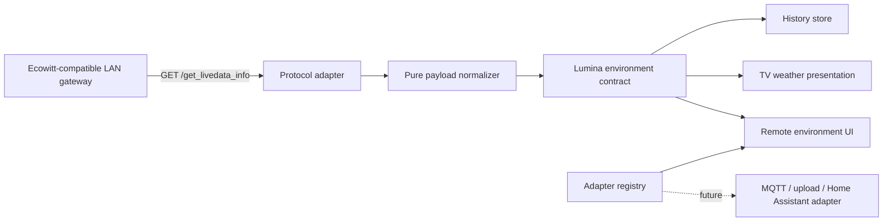

# Sensor Adapter Redesign Plan

Status: completed and merged through PRs #1 and #2; device-profile UX continues in `SENSOR_DEVICE_MANAGEMENT_PLAN.md`

## Problem statement

Lumina's first local sensor integration was developed and verified against one
Ecowitt GW1200. That was the correct empirical starting point, but the current
names and presentation accidentally promote the appliance model into the
adapter contract:

- `ecowitt-gw1200` is used as though it were a protocol identifier;
- the parser assumes indoor readings always arrive in `wh25[0]`;
- the admin interface repeatedly says GW1200 even though the endpoint is part
  of Ecowitt's generic LAN HTTP API;
- connection configuration, current readings, TV visibility, display units,
  raw payload inspection, and history are presented with nearly equal visual
  weight.

The result works, but it teaches the wrong mental model and makes the next
adapter look more expensive than it should be.

## Research findings

### Ecowitt compatibility

Ecowitt publishes `GET /get_livedata_info` as a generic LAN HTTP API across a
family of current gateways and consoles. The official Home Assistant
integration lists GW1100, GW1200, GW2000, GW3000 and several WN/WS consoles as
compatible with the local API. Sensor blocks vary by gateway, firmware, and
attached hardware. Indoor temperature, humidity, and pressure may be represented
by a `wh25` block or by typed entries in `common_list`.

Therefore, the defensible adapter boundary is **Ecowitt-compatible local HTTP**,
not **GW1200**.

### Libraries

The actively maintained `wittiot` package already handles a broad portion of
this protocol, and Ecowitt's Home Assistant integration uses it. It is Python,
however, while Lumina's daemon is a deliberately lightweight Node process.
Adding a Python sidecar, Home Assistant dependency, MQTT broker, or subprocess
bridge merely to perform one small HTTP request would increase operational and
resource cost more than it removes code.

Decision for this slice:

- keep native Node `fetch` and the small pure parser;
- make the parser tolerant of the protocol's alternate indoor representations;
- keep the adapter contract open for future ingress implementations;
- revisit `wittiot`, an Ecowitt custom-upload receiver, MQTT, or Home Assistant
  as separate adapters only when their broader capabilities are actually
  needed.

## Rubber-duck transcript

**Duck:** What is the adapter adapting?

**Answer:** A transport and payload protocol into Lumina's normalized
`environment` contract. It is not adapting a retail product name.

**Duck:** Is changing the label enough?

**Answer:** No. The parser must stop assuming that a successful payload always
contains `wh25[0]`, and the registry must be able to describe aliases,
protocols, transports, compatibility, and capabilities without leaking runtime
functions.

**Duck:** Do we need a general IoT framework now?

**Answer:** No. That would be a cathedral erected around one weather reading.
A small adapter manifest plus pure normalization functions preserves the open
extension seam without introducing brokers, discovery daemons, or schema
machinery.

**Duck:** What should the administrator see first?

**Answer:** The state of the room. The source configuration is important but
secondary. The useful order is:

1. current environment and health;
2. data source and connection controls;
3. display preferences;
4. history and diagnostics.

**Duck:** Should the UI offer an adapter selector with one option?

**Answer:** No. A one-item selector is theatre. Render the active adapter's
manifest now; introduce selection only when a second runnable adapter exists.

## Target architecture

## Implementation slices

### Slice 1 — protocol compatibility

- Keep the existing `wh25[0]` path as the first preference because it is
  verified against the installed gateway.
- Fall back to `common_list` IDs for indoor temperature (`0x01`), indoor
  humidity (`0x06`), absolute pressure (`0x08`), and relative pressure
  (`0x09`).
- Normalize mixed decimal/hex identifiers, numeric strings, and unit suffixes
  through pure helpers.
- Preserve the current external response shape and configuration key so the
  existing installation and sensor history remain compatible.

### Slice 2 — adapter metadata

- Let sensor adapters expose declarative metadata separately from runtime
  operations.
- Support aliases so a future canonical identifier can coexist with the legacy
  `ecowitt-gw1200` token during migration.
- Return immutable descriptions from `/api/environment/adapters`.

### Slice 3 — admin information architecture

Replace the present stack with three deliberate cards:

1. **Indoor environment** — status, current metrics, last observation, TV
   visibility, and refresh action.
2. **Data source** — adapter family, protocol, compatibility summary, enablement,
   URL, polling interval, units, and save action.
3. **History & diagnostics** — stored snapshot, export, and collapsed raw
   payload/configuration tools.

Use component-scoped CSS classes rather than another stratum of inline styles.
Retain the existing dark glass aesthetic, but strengthen hierarchy, spacing,
and state affordances.

### Slice 4 — verification and documentation

- Add focused tests for `common_list` fallback, `wh25` precedence, mixed ID
  encoding, adapter aliases, and immutable descriptions.
- Run `npm test` and `npm run build --prefix client` on Playwright.
- Verify the live gateway and TV presentation on Playwright.
- Inspect the final diff for private network data.
- Update the public developer log after verification.

## Acceptance criteria

- The admin interface does not claim that the protocol is exclusive to GW1200.
- The verified GW1200 payload continues to produce identical normalized values.
- A compatible payload containing only `common_list` indoor entries is parsed.
- Existing `config.ecowitt`, history rows, and TV consumers require no migration.
- Adapter descriptions contain no executable functions or mutable internal
  arrays.
- Advanced JSON and raw payloads remain available without dominating the page.
- No new runtime dependency is introduced.
- Full regression tests and the client build pass on Playwright.

## Deliberately excluded

- automatic LAN discovery;
- MQTT or Ecowitt custom-upload receivers;
- Home Assistant as a mandatory intermediary;
- arbitrary user-provided adapter code;
- a selector for adapters that do not yet exist;
- database migration or historical source rewriting.

These are legitimate future adapters or migration tasks, not prerequisites for
correcting the current abstraction.
