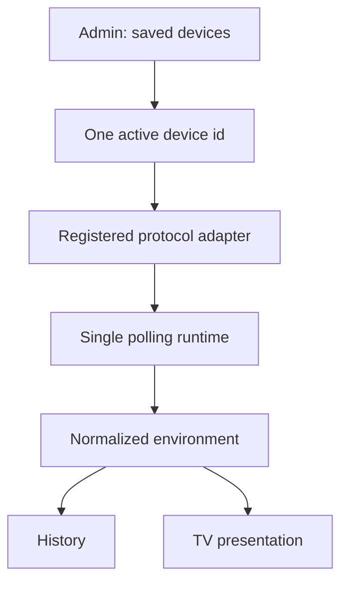

# Sensor Device Management Plan

Status: implementation complete on `agent/sensor-device-admin`; Playwright runtime verification pending

## Problem statement

The protocol-adapter refactor made Lumina's sensor boundary broader than the
verified GW1200, but the admin surface still exposes one flat Ecowitt settings
object. A user can edit that object's URL; they cannot add, name, retain, or
select a second compatible device.

The screen also presents two visually identical switches for unrelated actions:

- polling the configured local source; and
- showing indoor readings on the TV.

This makes a runtime mechanism look like another display preference and leaves
the primary task—adding a source—without an affordance.

## Research findings

### Device and protocol model

Ecowitt's generic local HTTP API is exposed by a family of gateways and
consoles, while the available measurements depend on their attached sensors.
The current adapter should therefore remain `ecowitt-local-http`; the device
profile supplies a friendly name and address rather than creating a new adapter
type for each retail model.

Home Assistant uses the recognizable **Settings → Devices & services → Add
integration** model and reports multiple Ecowitt gateways and sensor families as
compatible. Its integration is a push receiver, however, so adopting it would
not simplify Lumina's deliberately small local HTTP poller.

References:

- [Ecowitt generic HTTP API](https://oss.ecowitt.net/uploads/20260109/HTTP%20API%20interface%20Protocol%20%28Generic%29-%28V1.0.5-2025-10-08%29.pdf)
- [Home Assistant Ecowitt integration](https://www.home-assistant.io/integrations/ecowitt/)

### Responsive interaction model

Adaptive layout guidance treats compact and expanded windows as different
layouts, not merely different device categories. A device list beside its
editor uses desktop width productively and collapses into a linear phone flow.
Contained-list guidance supports inline actions for structurally similar
resources. Modal guidance recommends keeping repeatable management work on the
main page instead of repeatedly interrupting the user.

The existing `div`-based switches also lack native keyboard behavior and switch
semantics. The remaining TV visibility switch will use an accessible button
with `role="switch"` and a stable label.

References:

- [Android adaptive window size classes](https://developer.android.com/develop/ui/compose/layouts/adaptive/use-window-size-classes)
- [Carbon contained lists](https://carbondesignsystem.com/components/contained-list/usage/)
- [Carbon modal guidance](https://carbondesignsystem.com/components/modal/usage/)
- [WAI-ARIA switch pattern](https://www.w3.org/WAI/ARIA/apg/patterns/switch/)

## Rubber-duck transcript

**Duck:** Is “Ecowitt GW1200” a device, an adapter, or the polling process?

**Answer:** It is the first verified device. The adapter is the Ecowitt local
HTTP protocol implementation. Polling is the runtime behavior of whichever
saved device is active.

**Duck:** Does adding a device require multiple pollers and data fusion?

**Answer:** No. Profiles and concurrent ingestion are separate concerns. Lumina
can retain several profiles while reading exactly one active source. That gives
the user a real add/switch workflow without multiplying timers, history rules,
or environment semantics.

**Duck:** Should every device have an enable switch?

**Answer:** No. “Active source” is mutually exclusive, not a collection of
independent booleans. Each row should offer **Use this device**; the active row
should offer **Stop polling**. The only switch on the page controls the distinct
binary preference **Show indoor readings on TV**.

**Duck:** Should the add form be a modal?

**Answer:** No. Device management is repeatable and benefits from context. Use a
list–detail editor on desktop and stack the same regions on compact windows.
Reserve confirmation UI for removal.

**Duck:** Does the configuration need a general schema engine?

**Answer:** Not yet. Registered adapters remain selectable, but the only
runnable adapter currently uses the small shared connection shape: address,
poll interval, and timeout. Introduce adapter-specific field schemas only when
a second adapter proves that the fields differ.

## Target model



The canonical settings document is:

```json
{
  "activeDeviceId": "living-room",
  "devices": [
    {
      "id": "living-room",
      "name": "Living room",
      "adapterId": "ecowitt-local-http",
      "baseUrl": "http://gateway.local",
      "pollIntervalMs": 60000,
      "timeoutMs": 3000
    }
  ],
  "units": {
    "temperature": "C",
    "pressure": "hPa",
    "wind": "km/h",
    "rain": "mm",
    "light": "lux"
  }
}
```

For rollback and API compatibility, persistence and responses also project the
active device into the legacy flat `enabled`, `baseUrl`, `pollIntervalMs`, and
`timeoutMs` fields. Existing flat settings migrate into one saved profile.

## Implementation slices

### Slice 1 — pure settings model

- Normalize legacy and canonical settings into one device catalog.
- Generate stable, readable profile identifiers without external dependencies.
- Add pure upsert, removal, selection, projection, and validation helpers.
- Keep display units global because they are presentation preferences.

### Slice 2 — runtime and persistence

- Initialize the existing Ecowitt runtime from the active profile.
- Validate every profile against its registered adapter without starting it.
- Restart only the existing single runtime when the active profile changes.
- Persist the catalog and its legacy active-device projection atomically.

### Slice 3 — adaptive admin interface

- Lead with current room state and a clearly distinct TV visibility preference.
- Present saved devices as a contained list with status and direct actions.
- Provide a persistent add/edit pane at expanded widths and a stacked form on
  compact widths.
- Keep units, history, raw payload, and JSON tools subordinate to device setup.
- Use semantic buttons, labels, status messages, and keyboard-operable switches.

### Slice 4 — verification and documentation

- Cover migration, catalog transformations, adapter validation, active-source
  projection, and settings API compatibility with focused tests.
- Run lint, the full regression suite, and the client production build.
- Inspect responsive layouts at compact and expanded widths.
- Inspect the final public diff for local addresses and personal data.
- Update `AGENTS.md`, `DEVELOPER_LOG.md`, and configuration examples.

## Acceptance criteria

- A visible **Add device** action creates a named source through a normal form.
- A compatible non-GW1200 gateway can use the Ecowitt local HTTP adapter.
- Several profiles can be retained, but only one is polled at a time.
- The current installation migrates automatically and keeps its normalized
  environment, history, and TV contracts.
- Polling and TV visibility are no longer represented by look-alike toggles.
- The phone layout remains linear and touch-friendly.
- Expanded windows use a list–detail device manager and wider information grid.
- No runtime dependency, broker, database migration, or discovery daemon is
  introduced.

## Deliberately excluded

- simultaneous polling or fusion of several sources;
- automatic LAN discovery;
- arbitrary user-provided JavaScript adapters;
- MQTT, Home Assistant, or Ecowitt custom-upload ingestion;
- a generic dynamic-form schema before a second runnable adapter requires it;
- rewriting historical source identifiers.
